Over this term, we have done a significant amount of work surrounding the use of satellite and remote sensing data, and how it can be leveraged by distributed systems. Our project initially evolved around how to use satellite imagery from the sentinel 2 mission. The second phase of the project was finding applications for different data sources, and how they could be integrated with a variety of distributed applications. Our group ran into some issues as we were working this term with regards to team composition. There were a significant number of students who dropped the course early in the terms, which led to shifting team composition as the term progressed. As a result, our group was not fully formed until the end of phase 1 of the project.  Each member in our current group was originally from a different team, however- we still managed to collaborate efficiently on all project deliverables and achieve productive teamwork.  

# Project Phase 1

## Platform and Methods Review Document

In order to work with large amounts of data within a reasonable time frame, extensive computing resources are necessary. Often, these needs are well above what an individual has at their disposal. As a result, we will be using cloud computing platforms for this project. These are services which rent out computing resources such as processing power and storage. The platforms we are considering are Compute Canada’s Arbutus, Colaboratory on Google Cloud, Cognitive Services and Data Lake Analytics on Microsoft Azure, and Amazon Elastic MapReduce.

In order to fully understand the types of statistics and indicators we can create throughout this project, we need to explore the data available to us. The Copernicus program, started by the European Space Agency, provides free, open access to a variety of data produced by a pair of orbiting, Sentinel-2 satellites.  Working with such a vast data set allows for a plethora of statistics and indicators to be created. The applications for these vary significantly, as the parties involved have different needs. From land monitoring that highlights the effects of climate change to disaster relief organizations, border surveillance, and maritime monitoring, the metrics are widespread and are highly varied in scope.  

For the purposes of this project, the focus will be on environmental and climate variables. Metrics involving the environment are important for both economical development as well as increasing sustainability by ameliorating the population’s carbon footprint.  The metrics created in this section includes: The Environmental Monitoring Metrics (EMM) which will be responsible for analyzing current environmental data and comparing this data with what has been previously collected in order to detect patterns, identify changes, and generate predictive models for the future; The Land Management Metric (LMM) which will be responsible for providing land-use information to support planning of urban and agricultural regions; and the Water Pollution Metrics (WPM) will analyze geospatial data for indicators of water pollution along coastal regions, wetlands and in-land lakes. 

## Test sites, data, and proposed architecture involving Arbutus and at least one other platform

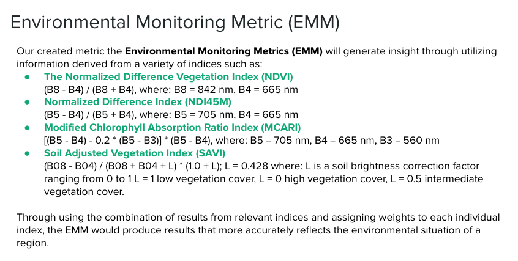

Proposed test sites:
- Testing Site #1 - Mid Vancouver Island and Cathedral Grove
- Testing Site #2 - Thompson River Valley
- Testing Site #3 - Vancouver

Tools used for proof of concept:
- Python
- Rasterio for Visualization
- Google Collab

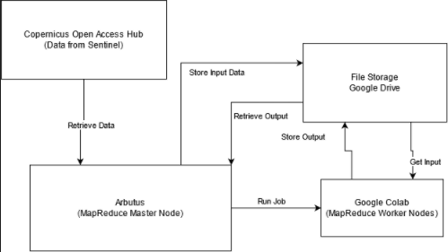

## Initial results for 3 example properties

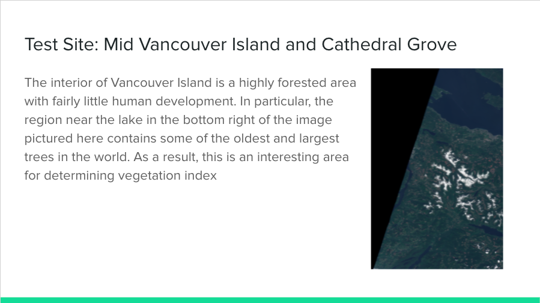
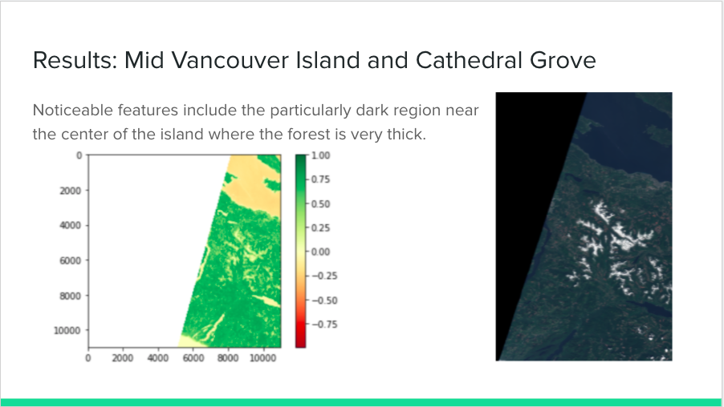
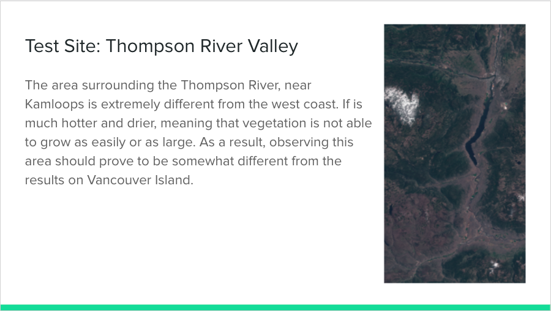
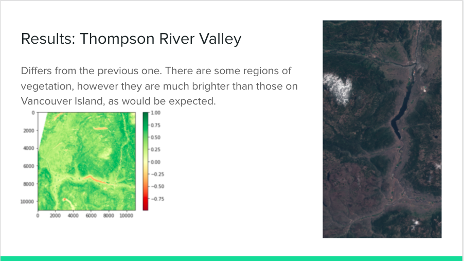
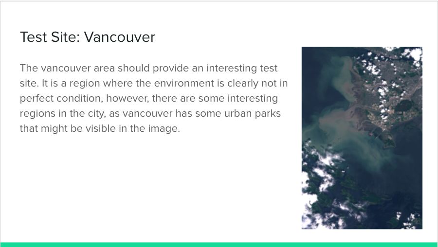
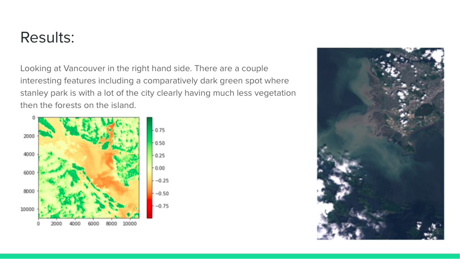

## Natural Asset monitoring prototype

Our created metric the Environmental Monitoring Metrics (EMM) will generate insight through utilizing information derived from a variety of indices such as:

Normalized Difference Vegetation Index (NDVI)
(B8 - B4) / (B8 + B4), where: B8 = 842 nm, B4 = 665 nm
Normalized Difference Index (NDI45M)
(B5 - B4) / (B5 + B4), where: B5 = 705 nm, B4 = 665 nm
Modified Chlorophyll Absorption Ratio Index (MCARI)
[(B5 - B4) - 0.2 * (B5 - B3)] * (B5 - B4), where: B5 = 705 nm, B4 = 665 nm, B3 = 560 nm
Soil Adjusted Vegetation Index (SAVI)
(B08 - B04) / (B08 + B04 + L) * (1.0 + L); L = 0.428 where: L is a soil brightness correction factor ranging from 0 to 1 L = 1 low vegetation cover, L = 0 high vegetation cover, L = 0.5 intermediate vegetation cover.

Through using the combination of results from relevant indices and assigning weights to each individual index, the EMM would produce results that more accurately reflects the environmental situation of a region.  

### Platforms used includes:

Google Colab

Google Colaboratory (Colab) is a hosted Jupyter notebook service that allows users to access computing resources, such as graphics processing units (GPUs) and Google’s tensor processing units (TPUs). Especially suited to data analysis, Colab allows users to execute Python 3 code on provided VMs.  Colab provides these resources for free, however there exists no guarantee on what underlying hardware is being used, nor how many resources are allocated.  

Copernicus Sentinel-2 Database

The Copernicus Open Access Hub  provides complete, free and open access to Sentinel-1, Sentinel-2, Sentinel-3 and Sentinel-5P user products, starting from the In-Orbit Commissioning Review (IOCR).  Sentinel-2 is a constellation with two twin satellites, Sentinel-2A and Sentinel-2B that conducts earth observation and systematically acquires optical imagery at high spatial resolution (10 m to 60 m) over land and coastal waters.

Architecture used:
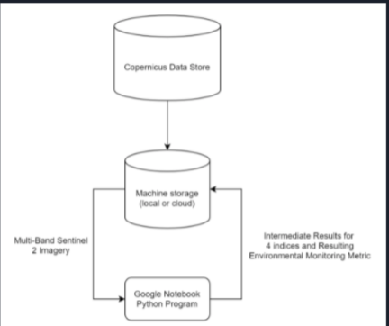

Final testing site was Vancouver site, generated results based on our created metric is as follows:
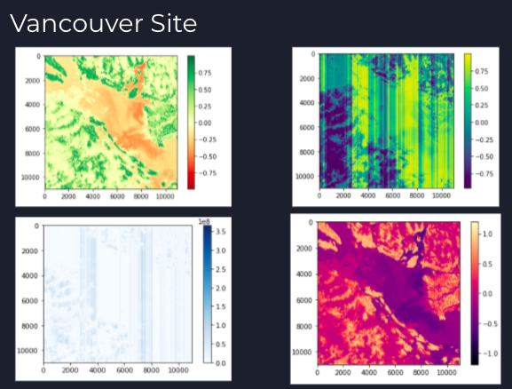
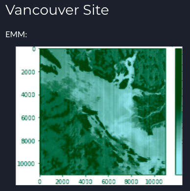

## Natural Asset monitoring report and notes on future work

In terms of potential future work, the focus should be on refining the results generated by the unique Environmental Monitoring Metric (EMM), especially research into how to weigh the different component metrics more effectively to generate more accurate results.  This could be done through machine learning analysis, further discussion with stakeholders, as well as incorporating further remote sensing data analysis research into the project.  Another aspect of consideration would be the implementation of other created metrics through a calculated composition of preexisting metrics, and creating an effective evaluation strategy for such designed metrics.  

# Project Phase 2

## Mosaic Review 

Mosaic is a remarcable up an comming tool that takes advanatage of sentinel satalight imagery. It does theis by combing the satalight images in the best way possible in order to create a high resolution satalight image that can be easily used and queried. This provided an interesitng insight into how proprietyary information can be created, and how that infomration can be used in other tools. Our analysis of mosica incluses a description of how it was to use, as well as some suggestion that might improve it in the future.

## Decentralized and Democratized Modern Platforms 
This was an opportunity to use the experienced gained so far to propose a new design for a distributed system from scratch. 

## Architecture Design and Prototype Implementation for local Drone and/or Sensor data

I haven't bailed on writing. Look, I'm generating a random paragraph at this very moment in an attempt to get my writing back on track. I am making an effort. I will start writing consistently again!

- (If you have to mention in points)
- abcdef
  - ghijk
  - lmno
* pqrst
* uvw

It was a question of which of the two she preferred. On the one hand,**Italics** the choice seemed simple. The more expensive one with a brand name would be the choice of most. It was the easy choice. The safe choice[url title](http://<url>). But she wasn't sure she actually preferred it.

### Any smaller font title

But nothing the copy said could convince her and so it didn’t take long until a
few insidious Copy Writers ambushed her, made her drunk with
[Longe and Parole](http://google.com) and dragged her into their agency, where
they abused her for their projects again and again. And if she hasn’t been
rewritten, then they are still using her.

> To highlight at the side
> Content
> Content

1.  Anything to be numbered
2.  abc
3.  def

# Display in a tabular format
| No.    | Y      | Z |
| :----- | :---| --: |
| 1      | ABC | P |
| 2      | DEF | Q |
| 3      | GHI | R |

